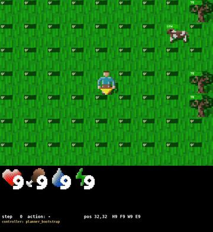

# CCSS — Continuous Cognitive Synthesis System

> Research architecture for general agents that learn continuously, with HDC/SDM associative memory and a symbolic top-down planner — not LLM, not deep RL.

🇷🇺 [Русская версия](README.ru.md)

[](docs/architecture-report-2026-05-11.md)
[](https://github.com/danijar/crafter)
[](src/snks/agent/crafter_pixel_env.py)
[](tests/agent)
[](LICENSE)

---

## Why this project exists

Modern AI systems — LLMs, deep RL agents — are *function approximators*. They
need huge datasets, suffer from catastrophic forgetting, and "think" by
generating tokens rather than by manipulating meaning.

SNKS is a research line investigating whether a different substrate — a
**phase-coupled, sparse-distributed, symbolically-bootstrapped** cognitive
system — can produce a general agent that:

- Learns *continuously*, with every step it takes, never in a separate batch.
- Bootstraps from a small **textbook** of explicit facts and refines those facts from experience.
- Treats *perception*, *world model*, *goal*, and *motivation* as four independent layers that share a common knowledge substrate.
- Scales the same machinery from a 64×64 game environment to substantially richer worlds without rewriting the agent.

The end-state we are working toward is a **Phase-Coupled Cognitive Substrate**
(PCCS) — one shared HDC state vector that perception, memory, stimuli, goal
selection and post-mortem reasoning all read from and write to each tick, with
Kuramoto phase coherence as the binding mechanism. The current Stage 91
codebase contains roughly half of that substrate as live, well-tested
infrastructure; the rest is the next year of work.

---

## The four layers (ideology in one screen)

The full ideology document lives at [`docs/IDEOLOGY.md`](docs/IDEOLOGY.md).
The TL;DR is this:

```
┌────────────────────────────────────────────────────────────────┐
│  FACTS         configs/crafter_textbook.yaml                   │  ← humans write
│  "do near tree → wood +1", "lava range=0 → health -1"          │
├────────────────────────────────────────────────────────────────┤
│  MECHANISMS    src/snks/agent/                                 │  ← algorithms
│  perceive → spatial_map → planner → sim → score → act          │
├────────────────────────────────────────────────────────────────┤
│  EXPERIENCE    runtime, per-step                               │  ← agent sees
│  SDM memory, spatial_map, surprise accumulator, death log      │
├────────────────────────────────────────────────────────────────┤
│  STIMULI       src/snks/agent/stimuli.py                       │  ← "why act"
│  SurvivalAversion, Homeostasis, Curiosity                      │
└────────────────────────────────────────────────────────────────┘

Top→bottom: knowledge stabilises and becomes "cheaper" (more static).
Bottom→top: experience is distilled into facts via promotion.
```

Each layer is replaceable in isolation. A new environment swaps the
*textbook* only; mechanisms, experience and stimuli are reused. This is
what we mean by "scales to other tasks" — not a fresh codebase per env.

---

## Current state (Stage 91 + Variant B)

The reference benchmark is the [Crafter](https://github.com/danijar/crafter)
environment, evaluated under strict CUDA determinism (byte-identical episodes
across runs at fixed seeds).



### What the agent does today

| Capability | Source | Status |
|---|---|---|
| Pixel-mode perception (CNN tile segmenter, 64×64 → 7×9 viewport) | `tile_segmenter`, `decode_head` | Pretrained, stable |
| Symbolic perception (semantic ground truth) | `perception.py` | Canonical eval path |
| HDC/SDM world model (binary vectors, dim=16384, 50000 sparse locations) | `vector_world_model.py` | Bootstrapped from textbook, online-learned per episode |
| Symbolic MPC planner with motion + crafting chains | `vector_mpc_agent.py` | Generates make/place plans, navigates to existing placed tiles |
| Goal selector derived from textbook threats | `goal_selector.py` | Weapon-aware: switches `fight_X` → `craft_<weapon>` when weapon missing |
| Emergency safety controller | `stage90r_emergency_controller.py` | Independent threat assessment, can override planner |
| Frozen advisory neural actor (`.pt`) | `stage90r_local_model.py` | Contributes a small bonus to action ranking |
| Spatial cognitive map with placed-object memory | `crafter_spatial_map.py` | Placed-object writes are authoritative over stale "empty" |
| Post-mortem damage attribution | `post_mortem.py` | Records death cause; feedback into planning is the next milestone |

### Reference benchmark — seed 17 ep 0, full-profile, strict determinism

Most recent recorded episode after Variant B (commit `7829711`):

```
episode_steps  : 147
death_cause    : skeleton
productive_do  : 47   (early-game wood / water / cow gathering)
place_table    : 2 successful (steps 23, 47)
make_wood_sword: 1 (step 48 — first successful weapon craft in this work line)
sleep flicker  : 0 (gated on energy < 3)
```

Variant B was a 12-fix stack that wired the textbook's adjacency rule
(`make_wood_pickaxe near: table`) end-to-end: a new `near_requirements`
table on the world model, chain plans `[place_X → make_Y]` only when no
instance of the required tile exists on the map, top-band RNG fallback so
rare crafting plans are not diluted among tied-zero motion plans, and a
placed-object override in the spatial map so `(28, 33) → "empty"` written at
conf=1.0 cannot block a subsequent `(28, 33) → "table"` write at the same
confidence. Each fix was validated on a single-seed video before scaling out.

The complete fix list and the architecture audit it came from:
[`docs/architecture-report-2026-05-11.md`](docs/architecture-report-2026-05-11.md).

---

## Architecture at a glance

```
env.step → info["semantic"]
   │
   ▼
PERCEPTION  (perceive_semantic_field, _update_spatial_map, _update_spatial_map_hazards)
   │
   ▼
WORLD MODEL  (VectorWorldModel = CausalSDM; vector_sim.simulate_forward rollouts)
   │
   ▼
GOAL SELECTOR  (symbolic, derived from textbook threats)
   │
   ▼
PLAN GENERATION  (motion + chain + single:target:do + craft chains)
   │
   ▼
SIMULATE + SCORE  (simulate_forward(plan) → score_trajectory(stimuli, goal))
   │
   ▼
RANK + RESCUE  (EmergencySafetyController, learner-actor advisory)
   │
   ▼
ACT  (env.step(primitive))
   │
   ▼
LEARN  (model.learn(target, action, observed_delta) + spatial_map.update)
```

Symbolic MPC on top of HDC/SDM associative memory. The "learned" portion is a
single advisory `.pt` actor contributing a ranking bonus; with `actor_share=0`
the system runs as a pure symbolic MPC agent over the HDC world model.

### Live surface (≈20 files of 71)

```
configs/crafter_textbook.yaml          ← FACTS — read first
docs/IDEOLOGY.md                       ← philosophy (the four categories)
docs/architecture-report-2026-05-11.md ← current state report

src/snks/agent/
├── crafter_pixel_env.py               (env wrapper, determinism patch)
├── crafter_textbook.py                (YAML loader)
├── crafter_spatial_map.py             (cognitive map + placed-object override)
├── perception.py                      (info["semantic"] → VisualField)
├── vector_world_model.py              (SDM, the main learned-without-grad memory)
├── vector_bootstrap.py                (textbook → SDM seeding)
├── vector_sim.py                      (forward rollout)
├── vector_mpc_agent.py                (main per-step orchestration)
├── goal_selector.py                   (threat-priority derivation)
├── stage90r_emergency_controller.py   (safety override layer)
├── stage90r_local_model.py            (advisory neural actor)
├── stimuli.py                         (Survival, Homeostasis, Curiosity)
└── post_mortem.py                     (damage attribution)
```

The rest of `src/snks/` — `daf/` (Dynamic Attractor Fields), `dcam/`,
`gws/` (Global Workspace), `metacog/`, `encoder/` (oscillator-based) — is
honest infrastructure parked from earlier stages and waiting to be wired into
the substrate. About 25% of the repo is dormant by design; the four-category
ideology calls these out as the *substrate* layer the next milestone activates.

---

## Determinism

Stage 91 closed a months-long nondeterminism investigation. The eval stack is
now byte-identical across runs at a fixed seed:

- `crafter.env.Env._balance_chunk` patched to sort objects by `(pos, type)`
  before iterating (Crafter's `set` iteration order depends on `id(obj)`,
  which `PYTHONHASHSEED` does not cover).
- `CausalSDM._calibrate_radius` offloads `kthvalue` to CPU
  (CUDA `kthvalue` has no deterministic implementation in torch 2.5.1+cu121).
- Required environment for evaluation:
  ```
  CUDA_VISIBLE_DEVICES=0
  CUBLAS_WORKSPACE_CONFIG=:4096:8
  PYTHONHASHSEED=0
  ```

---

## Roadmap

Short-term (weeks):

1. **Episodic Substrate Snapshots** — at every decision point, bundle the
   visible scene, inventory, body state, near concept, active goal and chosen
   plan origin into an HDC vector, write to a persistent episodic SDM,
   retrieve by similarity at the next planning step as an additional
   `EpisodicMemoryStimulus`. First cross-episode learning that does not
   require new rules in the textbook.
2. **Persistent placed-object memory** — keep placed tables and furnaces in
   the spatial map across viewport excursions instead of relying on
   re-observation.
3. **Emergency-safety craft override** — when goal is `craft_<weapon>` and
   the predicted craft is one step away, do not let `EmergencySafetyController`
   redirect the agent to flee.

Medium-term (months):

4. **TextbookPromoter activation** — close the *experience → facts* loop. Death
   hypotheses that recur across episodes get promoted into `promoted_hypotheses.yaml`,
   read by the next generation of the agent at bootstrap time.
5. **Replace lexicographic scoring with substrate decode** — substitute the
   `(base, goal_prog, known, -steps)` rank tuple with a single similarity-based
   readout from an HDC substrate that all components write to. Removes the
   `baseline-wins-ties → RNG fallback` failure mode end-to-end.
6. **Wire Kuramoto sync into substrate binding** — replace explicit
   role-vector XOR-binding with phase coherence
   (`tests/test_kuramoto_sync.py` already verifies the primitive).

Long-term (year):

7. **Phase-Coupled Cognitive Substrate (PCCS)** as the orchestration layer
   for all four ideology categories. Perception, world model, goal selector,
   stimuli, post-mortem and episodic memory all become pluggable substrate
   writers/readers. Decisions emerge from the substrate's attractor state,
   not from a fixed lexicographic rank tuple. Cross-task transfer becomes
   "swap the textbook and the substrate-role vocabulary; reuse everything else".

The architecture audit explains *why* each item is on the roadmap and how it
maps to a specific looseness in the current code:
[`docs/architecture-report-2026-05-11.md`](docs/architecture-report-2026-05-11.md).

---

## Quick start

```bash
python -m venv .venv
source .venv/bin/activate
pip install -e ".[dev]"

# Run the agent test suite (89 tests)
pytest tests/agent tests/encoder tests/learning tests/metacog tests/gws -q

# Record a single-seed video with perception overlay
CUDA_VISIBLE_DEVICES=0 CUBLAS_WORKSPACE_CONFIG=:4096:8 PYTHONHASHSEED=0 \
PYTHONPATH=src:experiments python experiments/record_stage91_seed_video.py \
  --seed 17 --episode-index 0 --full-profile \
  --local-evaluator path/to/stage90r_actor.pt \
  --out crafting_seed17_ep0.mp4
```

A pretrained local actor checkpoint is required for the recorder; it lives
under `_docs/` on the development machine and is not checked into git.

---

## Documentation

- [`docs/IDEOLOGY.md`](docs/IDEOLOGY.md) — the four-category ideology in full.
- [`docs/architecture-report-2026-05-11.md`](docs/architecture-report-2026-05-11.md) — what runs today, what is dormant, what the next steps are.
- [`SPEC.md`](SPEC.md) — full system specification (older revision; the ideology document supersedes it where they disagree).
- [`ROADMAP.md`](ROADMAP.md) — historical roadmap through Stages 0–30; the current direction is captured in the architecture report.
- [`docs/reports/`](docs/reports/) — per-stage closeout reports.

---

## License

[PolyForm Noncommercial 1.0.0](LICENSE). Noncommercial use — personal
research, education, hobby projects, public-research and nonprofit
organisations — is permitted. Commercial use requires a separate license
from the maintainer.
